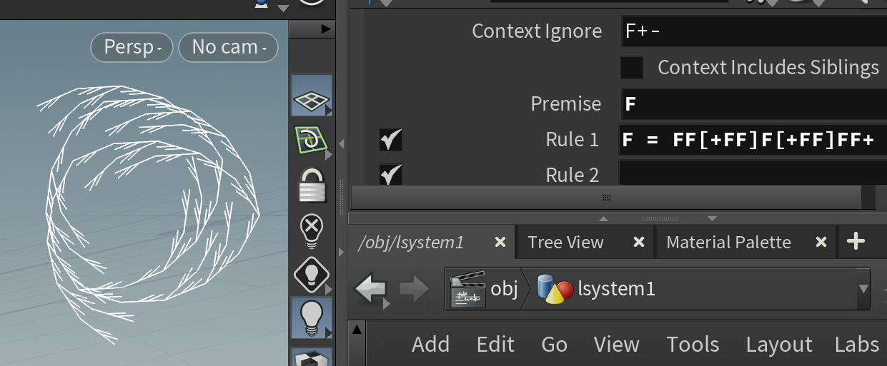
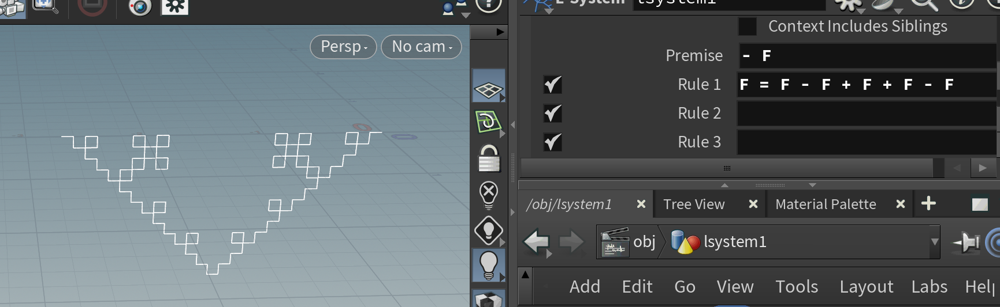
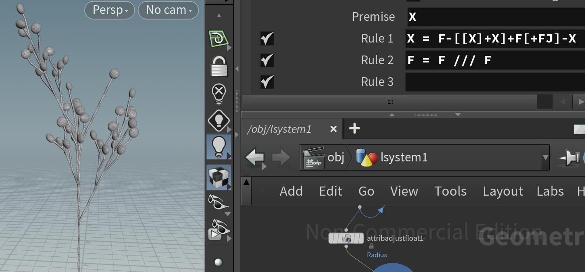
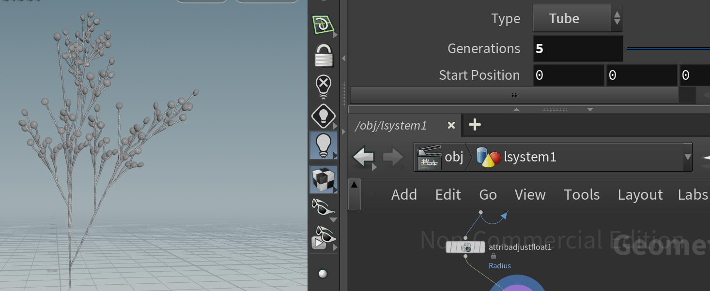
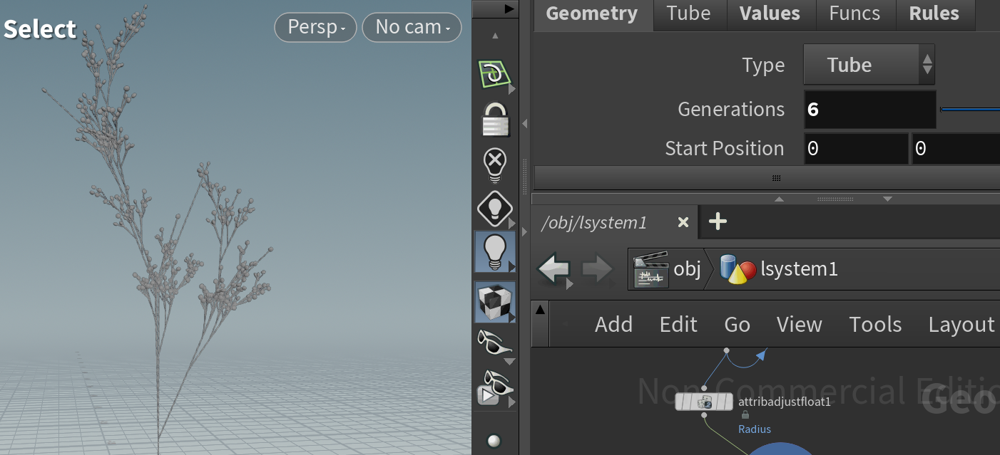

# lab04-grammars
## Puzzles

## Custom Plant

 The reference tree doesn't grow in a perfectly symmetrical way. Its main trunk gives way to a dominant side branch.  The rule, `[[X]+X]` creates a forked side branch, it will continue to grow and create its own sub-branches.  After a few generations, this side branch becomes strong that it can appear to take over as the new "leader," forcing the original trunk line (`-X`) to look like a secondary branch.

